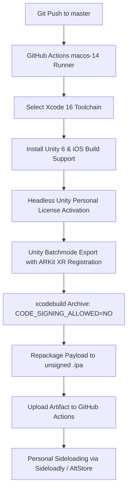

# Post-Mortem & Guide: Unity 6 iOS CI/CD & AR Deployment

A complete retrospective and operational blueprint distilled from the build pipeline development for **AR Paper Toss**. This document outlines the key failure modes encountered, root causes identified, architectural fixes applied, and a reusable checklist for future Unity iOS / AR projects.

---

## 1. Executive Summary & Pipeline Architecture

Building iOS applications without a dedicated local macOS workstation requires a cloud-based CI/CD bridge. Our pipeline achieves end-to-end automation:



---

## 2. Key Challenges & Root Cause Analysis

### A. Headless Unity Personal Licensing
* **Symptom:** Unity batchmode commands exiting immediately with license validation errors.
* **Root Cause:** Traditional static `.ulf` license files are tied to hardware machine GUIDs and fail on cloud virtual machines with dynamic MAC addresses.
* **Solution:** Used Unity 6's modern licensing client CLI:
  ```bash
  /Applications/Unity/Hub/Editor/6000.1.6f1/Unity.app/Contents/Frameworks/UnityLicensingClient.app/Contents/MacOS/Unity.Licensing.Client \
    --activate-all \
    --include-personal \
    --username "$UNITY_EMAIL" \
    --password "$UNITY_PASSWORD"
  ```

---

### B. Missing ARKit Symbols (`_UnityARKit_pointCloud_start`)
* **Symptom:** Xcode linker errors during `xcodebuild archive`:
  `Undefined symbols for architecture arm64: "_UnityARKit_pointCloud_start"`
* **Root Cause:** In Unity's AR Foundation package (`com.unity.xr.arkit`), native libraries (`libUnityARKit.a`) are **only copied into Xcode if the Apple ARKit XR Loader is explicitly registered in XR Plug-in Management for the iOS build target**. When Unity runs headlessly from a clean clone, XR loaders are unassigned by default.
* **Solution:** Created [`Assets/Editor/iOSBuildScript.cs`](file:///e:/Unity/Projects/AR%20Paper%20Toss/Assets/Editor/iOSBuildScript.cs) to programmatically configure XR settings and switch the active build target before triggering `BuildPipeline.BuildPlayer`:
  ```csharp
  // Switch platform and register ARKit Loader programmatically
  EditorUserBuildSettings.SwitchActiveBuildTarget(BuildTargetGroup.iOS, BuildTarget.iOS);
  XRPackageMetadataStore.AssignLoader(generalSettings.Manager, typeof(ARKitLoader).FullName, BuildTargetGroup.iOS);
  ```

---

### C. Swift 6 / Xcode 16 Compatibility Shims
* **Symptom:** Linker errors referencing Swift compatibility symbols:
  `Undefined symbols: "__swift_FORCE_LOAD_$_swift_Builtin_float", "__swift_FORCE_LOAD_$_swift_errno"`
* **Root Cause:** Unity 6 (`6000.1.6f1`) compiled `libUnityARKit.a` with Swift 6 (Xcode 16). The GitHub Actions `macos-14` runner defaulted to Xcode 15.4, which lacked these Swift standard library symbols.
* **Solution:** Dynamically discovered and selected Xcode 16 prior to compiling:
  ```bash
  XCODE_16_APP=$(find /Applications -maxdepth 1 -name "Xcode_16*.app" | sort -V | tail -n 1)
  sudo xcode-select -s "$XCODE_16_APP/Contents/Developer"
  ```

---

### D. Package Manifest & Assembly Definition Alignment
* **Symptom:** Editor script compilation failed with:
  `CS0246: The type or namespace name 'XR' does not exist in the namespace 'UnityEditor'`
* **Root Cause:** When packages are only transient dependencies, custom editor scripts in `Assets/Editor/` without an assembly definition fail to resolve namespaces during early batchmode compilation.
* **Solution:** 
  1. Declared explicit dependencies in `Packages/manifest.json` (`com.unity.xr.management`, `com.unity.xr.core-utils`).
  2. Created [`Assets/Editor/ARPaperToss.Editor.asmdef`](file:///e:/Unity/Projects/AR%20Paper%20Toss/Assets/Editor/ARPaperToss.Editor.asmdef) explicitly referencing the XR assemblies.

---

## 3. The 10-Minute Blueprint for Future Projects

For any new Unity 6 iOS/AR project, follow this exact checklist:

### Step 1: Add Explicit Dependencies
Ensure [`Packages/manifest.json`](file:///e:/Unity/Projects/AR%20Paper%20Toss/Packages/manifest.json) contains:
```json
"com.unity.xr.arfoundation": "6.1.1",
"com.unity.xr.arkit": "6.1.1",
"com.unity.xr.management": "4.5.1",
"com.unity.xr.core-utils": "2.5.2"
```

### Step 2: Add the Automated Build Script
Place `iOSBuildScript.cs` in `Assets/Editor/` with an accompanying `.asmdef`. Ensure it handles:
1. `EditorUserBuildSettings.SwitchActiveBuildTarget(BuildTargetGroup.iOS, BuildTarget.iOS);`
2. `PlayerSettings.iOS.cameraUsageDescription` assignment.
3. `PlayerSettings.SetArchitecture(..., 1)` (ARM64).
4. Programmatic `ARKitLoader` registration inside `XRGeneralSettings`.

### Step 3: Configure GitHub Secrets
Add two repository secrets under **Settings > Secrets and variables > Actions**:
* `UNITY_EMAIL`: Unity Personal account email.
* `UNITY_PASSWORD`: Unity Personal account password.

### Step 4: GitHub Actions Workflow ([`.github/workflows/build-ios.yml`](file:///e:/Unity/Projects/AR%20Paper%20Toss/.github/workflows/build-ios.yml))
Use the verified recipe:
* Runner: `macos-14` (Apple Silicon).
* Step 1: Select Xcode 16 via `find /Applications -name "Xcode_16*.app"`.
* Step 2: Install Unity Hub + Unity 6 (`6000.1.6f1`) with iOS build support.
* Step 3: Authenticate via `Unity.Licensing.Client --activate-all --include-personal`.
* Step 4: Export Xcode project with `-buildTarget iOS -executeMethod iOSBuildScript.Build`.
* Step 5: `xcodebuild archive CODE_SIGNING_ALLOWED=NO` and zip the `.app` inside `Payload/` to produce `.ipa`.
* Step 6: `actions/upload-artifact@v4`.

---

## 4. Summary Table of Solutions

| Area | Initial Failure | Working Solution |
| :--- | :--- | :--- |
| **Licensing** | Static `.ulf` license mismatch | CLI `--activate-all --include-personal` |
| **XR Integration** | ARKit plugin skipped | Scripted `ARKitLoader` assignment + `-buildTarget iOS` |
| **Compiler / Asmdef** | Missing XR namespaces | Explicit `manifest.json` entries + `Editor.asmdef` |
| **Linker / Toolchain** | Swift 6 missing symbols in Xcode 15.4 | Dynamically switched runner to Xcode 16 |
| **Code Signing** | Requires Apple Developer account ($99/yr) | Unsigned `.ipa` payload + Sideloadly on-device signing |

---

> [!TIP]
> Keep `gh` (GitHub CLI) authenticated locally (`gh auth login`). It allows immediate inspection of cloud build logs and 1-command artifact downloads (`gh run download <RUN_ID>`) directly to your workspace.
