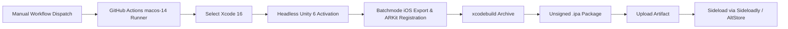

# 🗑️ AR Paper Toss

[](https://unity.com/)
[](https://docs.unity3d.com/Packages/com.unity.xr.arfoundation@6.1/)
[](https://developer.apple.com/augmented-reality/arkit/)
[](.github/workflows/build-ios.yml)
[](https://unity.com/srp/universal-render-pipeline)
[](LICENSE)

A retro 8-bit augmented reality arcade experience built in **Unity 6** with **AR Foundation** and **Apple ARKit**. 

Flick crumpled paper balls into a 3D trash can placed directly in your real-world environment. Navigate shifting crosswinds, evade patrolling paper airplane obstacles, trigger escalating combo fireworks, and rack up high scores with authentic chiptune audio and tactile haptic feedback.

---

## 🌟 Key Features

### 📍 Augmented Reality & Physical Surface Tracking
- **Smart AR Tap-to-Place:** Uses `ARRaycastManager` to scan your physical environment and detect horizontal planes (floors, desks, tables), with an Editor simulation fallback querying multi-scene physics geometry for rapid PC testing.
- **Holographic Targeting Indicator:** Smooth, gliding placement ring (`PlacementIndicator`) with continuous ambient rotation around the detected surface normal.
- **Real-Room Physics Collisions:** Detected AR planes carry active invisible physics colliders (`ARPlaneCollisionHandler`), and an automatic 100m² floor physics plane (`AR_FloorPhysicsPlane`) is generated at the placement height so errant throws bounce realistically off your real walls and floor.
- **Juicy Spawn-In Animation:** Procedural drop bounce animation with multi-stage elastic squash-and-stretch, tilt wobbles, and impact dust poofs when placing the trash can (`TrashCanAnimator`).

### 🏀 Aerodynamic Toss Physics & Flick Mechanics
- **Intuitive Touch Controls:** Responsive swipe/flick velocity calculation with configurable power presets: **LOW** (`0.40x`), **MED** (`0.60x` default), and **HIGH** (`0.90x`).
- **Realistic Paper Aerodynamics:** Quadratic air drag deceleration, micro-turbulence flight flutter (Perlin noise air wobble), launch spin torque, and anti-tunneling continuous dynamic sphere-casting against thin rim colliders.
- **Juicy Rim Reactions:** Decaying harmonic spring physics tilt and shake the trash can whenever a paper ball strikes the outer wall or inner rim.

### 💨 Dynamic Crosswinds
- Dynamic wind system (`WindManager`) that shifts speed (0 to 8 MPH) and perpendicular crosswind direction (Left/Right) every 6 seconds.
- World-space crosswind physics directly alter paper ball trajectories mid-air, challenging player precision.

### ✈️ Acrobatic Paper Airplane Obstacle
- Fully 3D folded paper airplane obstacle hovering and patrolling over the trash can rim (`PaperAirplaneController`, `ObstacleManager`).
- Configurable flight patterns (`LoopDeLoop`, `HoopHoverBlock`, `FigureEight`, `Orbit`) with dynamic aerodynamic banking and micro-turbulence flutter.
- Inelastic deflection physics and an acrobatic spin-out tumble recovery routine when struck by a paper ball, accompanied by dedicated deflection SFX and sparks.

### 🎆 Retro 8-Bit Arcade Polish & Juice
- **Pocket GUI Retro UI:** Styled retro arcade UI featuring the `PressStart2P` pixel font, animated floating combo popups (`* SWISH! *`, `* COMBO x{N}! *`, `* NEW RECORD! *`), and safe-area notch layout (`SafeArea`) with iPhone Dynamic Island simulation support.
- **Tiered Celebration VFX:** Particle celebrations via Cartoon FX Remaster scale dynamically with your combo streak:
  - **Tier 1 (1x Swish):** Clean light burst & gentle falling stars.
  - **Tier 2 (2x Double):** Cyan-purple fireworks explosion & star shower.
  - **Tier 3 (3x On Fire!):** Intense flame burst & golden sparks.
  - **Tier 4 (4x Lightning!):** Electric plasma arcs & high-voltage sparks.
  - **Tier 5+ (5x+ Godlike):** Mega rainbow fireworks and celebratory golden rays.
- **Dynamic 8-Bit Chiptune Audio:** Self-healing `AudioSource` pool with pitch-escalating combo jingles, rim thuds, misses, button clicks, and separate Title / Gameplay BGM.
- **Haptic Vibration Feedback:** Tactile on-device vibration feedback on ball launch, successful baskets, and UI interactions.

---

## 🏗️ Architecture & Project Structure

The project follows a clean, decoupled event-driven architecture:

```
AR Paper Toss/
├── Assets/
│   ├── Editor/
│   │   ├── iOSBuildScript.cs         # Automated headless build & XR ARKit config
│   │   └── ARPaperToss.Editor.asmdef # Assembly definition for CI/CD batchmode
│   ├── Prefabs/
│   │   ├── ARPlane.prefab            # Invisible AR plane collider surface
│   │   ├── PaperAirplane.prefab      # 3D folded airplane obstacle with trail
│   │   ├── PaperBall.prefab          # Physics-driven paper projectile
│   │   ├── PlacementIndicator.prefab # Holographic surface placement ring
│   │   ├── RealisticRoom.prefab      # XR simulation room for Editor testing
│   │   └── TrashCan.prefab           # Animated trash can with inner score trigger
│   ├── Scripts/
│   │   ├── AR/
│   │   │   ├── ARPlaneCollisionHandler.cs # Physics colliders on detected AR planes
│   │   │   ├── ARSessionManager.cs        # AR lifecycle & tracking validation
│   │   │   ├── PlacementController.cs     # Raycast placement & reticle logic
│   │   │   └── PlacementIndicator.cs      # Smooth visual indicator tracking
│   │   ├── Audio/
│   │   │   ├── AudioManager.cs            # Pooled 8-bit SFX & BGM controller
│   │   │   └── HapticManager.cs           # iOS/Android device vibration feedback
│   │   ├── Gameplay/
│   │   │   ├── ObstacleManager.cs         # Spawns & coordinates airplane obstacle
│   │   │   ├── PaperAirplaneController.cs # Flight patterns, banking & tumble recovery
│   │   │   ├── PaperBall.cs               # Aerodynamic drag, flutter & collision
│   │   │   ├── PaperBallLauncher.cs       # Touch flick gestures & ball spawning
│   │   │   ├── ScoreTrigger.cs            # Inner basket validation & confetti trigger
│   │   │   ├── TrashCanAnimator.cs        # Procedural spawn drop & rim recoil wobble
│   │   │   ├── VFXManager.cs              # Multi-tier streak celebration particles
│   │   │   └── WindManager.cs             # Crosswind vector generation & events
│   │   └── UI/
│   │       ├── MainMenuUI.cs              # Retro title screen, tutorials, navigation
│   │       ├── SafeArea.cs                # Device notch & home bar dynamic anchoring
│   │       ├── ScoreboardUI.cs            # Zero-padded HUD, combo banners, refresh
│   │       ├── SettingsManager.cs         # Audio, haptic, sensitivity persistence
│   │       └── SettingsMenuUI.cs          # Modal settings drawer with reset confirmation
│   └── Scenes/
│       └── SampleScene.unity              # Master AR gameplay scene
├── .github/
│   └── workflows/
│       └── build-ios.yml                  # Automated macOS GitHub Actions CI/CD
├── IOS_BUILD_GUIDE.md                     # Complete blueprint for iOS cloud builds
└── LICENSE                                # MIT License
```

---

## 🚀 CI/CD & Automated Cloud Builds

Building iOS AR apps without a dedicated macOS workstation is supported out of the box via GitHub Actions.



- **Workflow:** [`.github/workflows/build-ios.yml`](.github/workflows/build-ios.yml) (triggered on-demand via `workflow_dispatch` to conserve runner minutes)
- **Runner:** `macos-14` (Apple Silicon M1/M2)
- **Toolchain:** Xcode 16 + Unity 6 (`6000.1.6f1`) with iOS Build Support
- **Output:** An unsigned `.ipa` artifact ready for free 7-day personal Apple ID sideloading (no $99/yr paid developer account required).
- **Technical Retrospective:** See [`IOS_BUILD_GUIDE.md`](IOS_BUILD_GUIDE.md) for root-cause solutions regarding headless Unity licensing, ARKit native symbol registration, and Swift 6 shims.

---

## 🎮 Getting Started & Development

### Prerequisites
- **Unity:** Version `6000.1.6f1` (Unity 6)
- **Modules:** iOS Build Support (if compiling locally for iOS)
- **Hardware:**
  - **In-Editor:** Any PC running Unity (uses simulated room environment)
  - **On-Device:** iPhone / iPad running iOS 15.0+ with ARKit support

### Running in the Unity Editor
1. Clone this repository:
   ```bash
   git clone https://github.com/Jmmmmjm/ar-paper-toss.git
   ```
2. Open the project in **Unity Hub** using version `6000.1.6f1`.
3. Open `Assets/Scenes/SampleScene.unity`.
4. Press **Play**.
5. Move the mouse to position the holographic indicator over the simulated floor/desk, left-click to place the trash can, and click-and-drag upward to flick paper balls.

### Triggering a Cloud Build
1. Ensure repository secrets `UNITY_EMAIL` and `UNITY_PASSWORD` are set under **Settings > Secrets and variables > Actions**.
2. Trigger the workflow manually:
   - **Via GitHub Web:** Go to **Actions** → **Build iOS IPA** → **Run workflow**.
   - **Via GitHub CLI:**
     ```bash
     gh workflow run build-ios.yml
     ```
3. Once completed, download the `ARPaperToss-iOS-IPA` artifact:
   ```bash
   gh run download <RUN_ID> -n ARPaperToss-iOS-IPA
   ```
4. Sideload onto your iOS device using [Sideloadly](https://sideloadly.io/) or [AltStore](https://altstore.io/).

---

## 🕹️ Controls & How to Play

| Action | Control (iOS Device) | Control (Unity Editor) |
| :--- | :--- | :--- |
| **Place Trash Can** | Move camera over floor/table, tap green ring | Aim reticle over surface, Left Click |
| **Toss Paper Ball** | Swipe / flick up from bottom of screen | Click and drag upward, release |
| **Curve Shot** | Swipe at an angle to curve left/right | Drag diagonally |
| **Reposition Can** | Tap `[REFRESH]` button on the top HUD | Click `[REFRESH]` button |
| **Settings & Audio** | Tap `[SETTINGS]` on the top-right | Click `[SETTINGS]` button |

---

## 📜 License

This project is licensed under the MIT License - see the [LICENSE](LICENSE) file for details.
